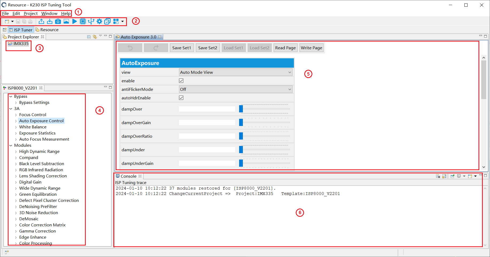
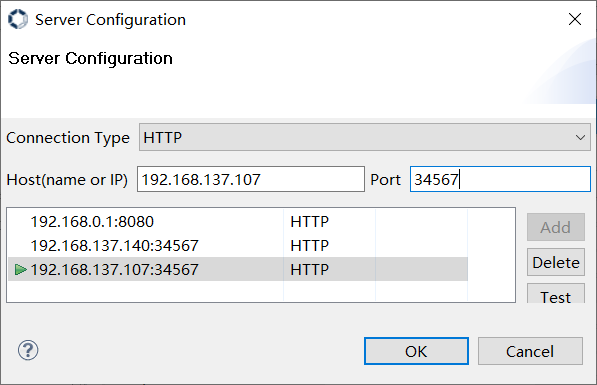
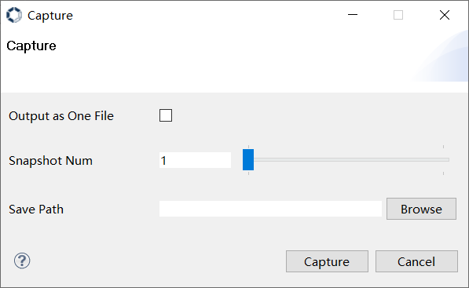

# K230 ISP Tuning Tool User Guide

Copyright © 2023 Canaan Creative Information Technology Co., Ltd.

## Disclaimer

The products, services, or features you purchase are subject to the commercial contracts and terms of Canaan Creative Information Technology Co., Ltd. (hereinafter referred to as "the Company") and its affiliates. All or part of the products, services, or features described in this document may not be within the scope of your purchase or use. Unless otherwise agreed in the contract, the Company does not provide any explicit or implicit statements or warranties regarding the accuracy, reliability, completeness, merchantability, fitness for a particular purpose, and non-infringement of any statements, information, or content in this document. Unless otherwise agreed, this document is only for reference as a usage guide.

Due to product version upgrades or other reasons, the content of this document may be updated or modified without any notice.

## Trademark Statement

 "Canaan" and other Canaan trademarks are trademarks of Canaan Creative Information Technology Co., Ltd. and its affiliates. All other trademarks or registered trademarks mentioned in this document are owned by their respective owners.

**Copyright © 2023 Canaan Creative Information Technology Co., Ltd. All rights reserved.**
Without the written permission of the Company, no unit or individual may excerpt, copy any part or all of the content of this document, nor disseminate it in any form.

## Table of Contents

[TOC]

## Preface

### Overview

This document describes the usage instructions for the Tuning Tool.

### Audience

This document (this guide) is mainly intended for the following personnel:

- Technical Support Engineers
- Software Development Engineers

### Abbreviations

| Abbreviation | Description                                               |
|--------------|-----------------------------------------------------------|
| BLS          | Black Level Subtraction                                   |
| HDR          | High Dynamic Range                                        |
| 3A           | AE (Auto Exposure), AF (Auto Focus), AWB (Auto White Balance) |
| DG           | Digital Gain                                              |
| LSC          | Lens Shading Correction                                   |
| WB           | White Balance                                             |
| DM           | Demosaic                                                  |
| DPCC         | Defect Pixel Cluster Correction                           |
| DPF          | Denoising Prefilter                                       |
| CNR          | Color Noise Reduction                                     |
| CAC          | Chromatic Aberration Correction                           |
| CA           | Color Adjustment                                          |
| DCI          | Dynamic Contrast Improvement                              |
| 2DNR         | 2D Noise Reduction                                        |
| 3DNR         | 3D Noise Reduction                                        |
| GC           | Gamma Correction                                          |
| GE           | Green Equilibrate                                         |
| EE           | Edge Enhance                                              |
| CP           | Color Processing                                          |
| ROI          | Region Of Interest                                        |
| DW           | De-warp                                                   |
| TS           | Tuning-Server                                             |
| TC           | Tuning-Client                                             |
| RTSP         | Real Time Streaming Protocol                              |

### Revision History

| Document Version | Description of Changes            | Author  | Date       |
|------------------|-----------------------------------|---------|------------|
| V1.0             | Initial version                   | Guo Shidong | 2023-02-20 |
| V1.1             | Updated part of the feature description | Liu Jia'an | 2023-04-07 |
| V1.2             | Updated part of the feature description, added new features | Guo Shidong | 2023-05-05 |
| V1.3             | Added RTSP feature description    | Guo Shidong | 2023-07-28 |
| V2.0             | Updated to new version VTunerClient | Huang Ziyi | 2024-01-10 |
| V2.1             | Updated part of the feature description, added new features | Rong Jian | 2024-01-11 |
| V2.2             | Updated part of the feature description | Rong Jian | 2024-01-30 |
| V2.3             | Updated part of the feature description | Rong Jian | 2024-04-28 |

## 1. Module Software Architecture

Figure 1-1

## 2. Tuning Tool Connection and Activation

### 2.1 Tool Acquisition Path

| **File Name**      | **Storage Location**       | **Function**                                            |
|--------------------|----------------------------|---------------------------------------------------------|
| PC tuning-tool software package (K230 ISP Tuning Tool.exe) | release source package k230_sdk/tools/tuning-tool-client/K230_ISP_Tuning_Tool_20240129.7z | Used for image dump, ISP debugging, and other PC tools |
| t_server_c-6.1.0   | Small core file system /mnt | Tuning server executable program                        |
| sample_sys_init.elf | Large core file system /sdcard/app | Large core server side                                  |

### 2.2 Startup Procedure

1. Configure the IP on the small core of the board.
1. After the small core of the board waits for sharefs to start, start sample_sys_init.elf on the large core, and run `/sharefs/app/sample_sys_init.elf`.
1. Start the tuning server on the small core of the board, and run `/mnt/t_server_c-6.1.0`, adding parameters as needed. Use the `-?` parameter to view help.
1. Start the tuning tool on the PC and connect to K230.

## 3. Tuning Tool Interface Introduction

Figure 3-1

As shown in Figure 3-1, the basic operation UI of the tuning tool is divided into six areas:

(1) Menu Operation Area: File operations, window management, etc.

(2) Toolbar Area: Supports key functions

| Button | Description |
|--------|-------------|
|  | Export settings to a file |
|  | Import settings from a file |
|  | Capture image or video |
|  | Send local raw image or video to the debugging server for ISP processing |
|  | Video preview |
|  | Configure registers |
|  | Configure connection to debugging server |
|  | Modify preferences |
|  | Adjust multiple parameters in one batch |
|  | Provide access to additional components |

(3) Project Management Area: Select and manage different projects

(4) Function Area: Used for switching UI of various ISP modules

(5) Debugging Area: Used for debugging parameters of a specific module

(6) Echo Area: Used to print logs of parameter sending and receiving

### 3.1 Connect to Board-side Tuning Server

#### 3.1.1 Connect to Board-side Tuning Server Using HTTP

The SDK supports HTTP connection by default. Click the configure connection to debugging server button  in the toolbar, and the window shown in Figure 3-2 will pop up.

Figure 3-2

Select HTTP mode, ensure that the PC and the board-side network are in the same subnet, enter the board-side IP in the "Host" input box, and enter the fixed port 34567 in the "Port" input box. After configuration, click the "OK" button. If the board-side tuning-server has been started, the connection will be automatically completed. Switch any module in area ④ of Figure 3-1 to see the function print of the tuning-server.

### 3.2 Create/Select Project

If the project to be debugged is already in area ③ of Figure 3-1, click to select the project to start ISP debugging.
If the project to be debugged has not been created, create the project first.

#### 3.2.1 Create Debugging Project

As shown in Figure 3-3, click File -> New -> Project... sequentially, and the project creation wizard window will pop up as shown in Figure 3-4.

Figure 3-3

Figure 3-4

Click the "ISP" directory to display the "ISP Project Wizard". Click on "ISP Project Wizard" and then click the "Next" button to pop up the project creation window as shown in Figure 3-5.

Figure 3-5

Enter the project name, specify the project address, and click the "Finish" button to complete the project creation. The project will be displayed in area ③ of Figure 3-1. Click the project to start ISP debugging.

### 3.3 Online Debugging Interface and Function Description

This section briefly introduces the main functions of the debugging modules on the tuning tool interface. The specific debugging strategies and steps are described in detail in the image tuning document.

The ISP function modules are shown in Figure 3-6.

Figure 3-6

#### 3.3.1 Bypass Settings

Enable control of all ISP function modules.

#### 3.3.2 Auto Focus Control (Focus Control)

Focus control debugging module.

When auto mode is selected (Auto Mode View), the interface list shows Auto Focus Control; when manual mode is selected (Manual Mode View), the interface list shows Focus Control.

#### 3.3.3 Auto Exposure Control (Exposure Control)

Exposure control debugging module.

When auto mode is selected (Auto Mode View), the interface list shows Auto Exposure Control; when manual mode is selected (Manual Mode View), the interface list shows Exposure Control.

Auto exposure control parameters control image brightness and AE adjustment convergence speed, etc.

Supports setting ROI window. To enable ROI mode, select FIX mode in semMode and enable AE.

#### 3.3.4 Auto White Balance (White Balance)

White balance control debugging module.

When auto mode is selected (Auto Mode View), the interface list shows Auto White Balance; when manual mode is selected (Manual Mode View), the interface list shows White Balance.

#### 3.3.5 Exposure Statistics

Not supported yet.

#### 3.3.6 Auto Focus Measurement

Not supported yet.

#### 3.3.7 High Dynamic Range

Multi-exposure wide dynamic range, adjustable exposure ratio between exposures, and fusion range.

#### 3.3.8 Compand

Data stretching and compression module, adjustable action curves.

#### 3.3.9 Black Level Subtraction

Provides sensor-related black level correction, adjustable for R, Gr, Gb, and B channels.

#### 3.3.10 RGB Infrared Radiation

Not supported yet.

#### 3.3.11 Lens Shading Correction

Provides lens shading correction, calibration coefficients are generated by the calibration tool.

#### 3.3.12 Digital Gain

Enables and adjusts ISP Digital Gain.

#### 3.3.13 Wide Dynamic Range

Provides global and local contrast adjustment for images.

#### 3.3.14 Green Equilibrate

Calibrates the imbalance between Gr and Gb channels, adjustable green balance strength.

#### 3.3.15 Defect Pixel Cluster Correction

Provides functions for detecting and calibrating pixel defects, different calibration methods can be set by selecting set.

#### 3.3.16 Denoising Prefilter

Bilateral filtering denoising module.

#### 3.3.17 3D Noise Reduction

Adjusts the image noise reduction intensity by configuring parameters.

#### 3.3.18 Demosaic

Converts Bayer format raw images to RGB images through interpolation, providing anti-moire, anti-purple fringe, sharpening, and noise reduction functions.

This module also includes a CAC sub-module for correcting chromatic aberration mainly introduced by the lens, calibration parameters are generated by the calibration tool.

#### 3.3.19 Color Correction Matrix

Color restoration matrix. Adjusting the 3x3 CCM matrix and offset can calibrate color deviation.

#### 3.3.20 Gamma Correction

Supports custom gamma, the gamma index can be changed in this mode.

#### 3.3.21 Edge Enhance

Enhances image clarity. By setting appropriate parameters, it enhances image clarity while suppressing noise enhancement.

This module also includes CA and DCI sub-modules.

The CA module adjusts image saturation. It adjusts saturation based on changes in image brightness or original saturation to achieve local saturation adjustment, making bright areas more vivid and eliminating color noise in dark areas or low saturation areas.

The DCI module adjusts image dynamic contrast.

#### 3.3.22 Color Processing

Color processing module, adjustable image contrast, brightness, saturation, and hue, setting different color preferences or styles.

### 3.4 Capture Image

### 3.4.1 Set Image Format and Size

Click the preview button in the toolbar , and the window shown in Figure 3-7 will pop up.

Figure 3-7

Check "Stream Enable". In the "Output Format" section, select the image format you need to capture:

- For capturing YUV images, currently only 8-bit yuvNV12 format data is supported, so select "YUV420 Semi_Planar".
- For capturing raw data images, select the appropriate bit width option according to the raw data bit width accessed by the ISP.

As shown in Figure 3-8, correctly set the image size in the "Output Size" section.

Figure 3-8

Click the "OK" button to complete the settings.

#### 3.4.2 Capture Image

Click the capture button in the toolbar , and the window shown in Figure 3-9 will pop up.

Figure 3-9

In the "Save Path" section, select the location to save the image file.

- To capture a single frame image, simply click the "Capture" button.
- To capture multiple frames, set the number of frames to be captured in the "Snapshot Num" option and configure the "Output as One File" option (checked or unchecked) based on the desired number of output files. After completing the above configuration, click the "Capture" button to start capturing.

### 3.5 Import and Export Parameters

#### 3.5.1 Import Parameters

The tool supports importing parameter files in standard XML and JSON formats by default, divided into calibration parameters and tuning parameters, and supports local import on the PC.

Click the import button in the toolbar , and the window shown in Figure 3-10 will pop up.

Figure 3-10

In the window shown in Figure 3-10, select the XML or JSON parameter file you need to import, and click the "Open" button to start importing.

#### 3.5.2 Export Parameters

The tool's default export method will summarize the online debugging parameters into a JSON file for storage.

Click the export button in the toolbar , and the window shown in Figure 3-11 will pop up.

Figure 3-11

In the window shown in Figure 3-11, select the JSON parameter file you need to export, and click the "Save" button to start exporting.
