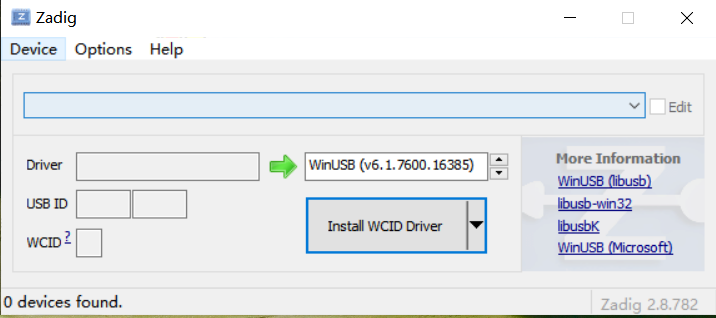

# K230 Scenario Practice - DPU Depth Camera POC


Copyright © 2023 Beijing Canaan Creative Information Technology Co., Ltd.

<div style="page-break-after:always"></div>

## Disclaimer

The products, services, or features you purchase are subject to the commercial contracts and terms of Beijing Canaan Creative Information Technology Co., Ltd. (hereinafter referred to as "the Company") and its affiliates. All or part of the products, services, or features described in this document may not be within the scope of your purchase or use. Unless otherwise agreed in the contract, the Company does not provide any express or implied statements or warranties regarding the accuracy, reliability, completeness, merchantability, suitability for a particular purpose, or non-infringement of any statements, information, or content in this document. Unless otherwise agreed, this document is only for use as a reference guide.

Due to product version upgrades or other reasons, the content of this document may be updated or modified periodically without any notice.

## Trademark Statement

 "Canaan" and other Canaan trademarks are trademarks of Beijing Canaan Creative Information Technology Co., Ltd. and its affiliates. All other trademarks or registered trademarks mentioned in this document are owned by their respective owners.

**Copyright © 2023 Beijing Canaan Creative Information Technology Co., Ltd. All rights reserved.**
Without the written permission of the Company, no unit or individual may excerpt, copy, or disseminate any part or all of the content of this document in any form.

<div style="page-break-after:always"></div>

## K230 DPU Depth Camera

Simulate the K230 device as a depth camera, transmitting the depth map processed by the internal DPU module to a PC in real-time. It supports multiple data transmission formats, multiple K230 devices, and stream/snap functions with stream performance reaching 720p@10fps.

### Hardware Environment

- K230-USIP-LP3-EVB-V1.0/K230-USIP-LP3-EVB-V1.1/CanMV-k230-V1.0/CanMV-k230-V1.1 * 1
- Specified sensor module * 1
- A PC with Windows system
- Two Type-C cables

## Overview

The DPU Depth Camera POC supports the following features:

- PC-side support for capturing images in various formats: such as color images, depth maps, speckle patterns, infrared images, etc.
- Support for stream/snap capture methods: can capture real-time data streams or a single frame image.
- PC-side can connect multiple K230 devices, supporting simultaneous image capture from multiple K230 devices.
- Transmission performance: In stream mode, each K230 device achieves 720p@10fps.
- Frame rate control: Can set the number of frames transmitted per second.

## Instructions

1. Compile and burn the image: The compile command is `make CONF=k230_evb_dpu_depth_camera_defconfig`. The generated image is located at `output/k230_evb_dpu_depth_camera_defconfig/images/sysimage-sdcard.img`. Burn this image, and the DPU depth camera program will run automatically after startup.
1. Update the K230 device UVC driver to "WinUSB" on the PC: Refer to the introduction in the following sections.
1. Execute on the PC: First, download the files from the `k230_sdk/src/common/cdk/user/thirdparty/windows_uvc/lib_uvc/bin/x64/release` directory to the PC. Then execute the `run.bat` file in this folder. You can modify the content of the batch file to execute different functions.
   The `run.bat` file uses the `test_uvc.exe` command to execute different functions. The `test_uvc.exe` command is as follows:

```shell
Usage: grab stream frame Usage: %s -s 0 -m 0 -f ./bin/0702/H1280W720.bin -t 0 -a 19 -b 20 -n "0701".
       snap frame  Usage: %s -s 1 -m 1 -f ./bin/0702/H1280W720.bin -t 0.
       transfer file Usage: % s -m 2 -i ./bin/H1280W720_conf.bin -o /sharefs/H1280W720_conf.bin.
          -s <local filepathname>: save frame data to local file
          -m <work mode>: work mode. 0:grab data,  1:snap data, 2:tranfer file
          -i <local filepathname>: transfer local filename.
          -o <remote filepathname>: k230 receive filename.
          -f <ref/cfg filepathname>: k230 update ref/cfg file.
          -t <dpu image mode>: dpu image mode.
          -r <fps>: set fps.
          -a <sensor type0>:sensor type0,default is 20,see vicap doc.
          -b <sensor type1>:sensor type1,default is 19,see vicap doc.
          -n <init serialnumber>:init seialnumber,default is 0701.
          -d <gdma rotate>:0: Rotate 0, 1: Rotate 90, 2: Rotate 180, 3:Rotate 270. evb Rotate 90 and canmv Rotate 270.
```

## Update Driver

After downloading the files from the `k230_sdk/src/common/cdk/user/thirdparty/windows_uvc/lib_uvc/bin/x64/release` directory to the PC, please update the UVC driver on Windows before running the batch script.

- Ensure the K230 big and small cores start normally and simulate it as a USB device. Connect the K230 OTG port to the PC USB port using a Type-C cable.
- Double-click the `zadig-2.8.exe` software in the release directory. After opening, click the menu bar: Options->List All Devices, and select this option.


- Select the K230 UVC device from the drop-down list, named "UVC Camera (interface 0)".

- If the Windows driver for this device has not been updated, Windows will default to installing the "usbvideo" driver. In this case, it needs to be replaced with the "WinUSB" driver. Click the "Replace Driver" button to replace the driver.


- As shown in the above image, the "WinUSB" driver has been successfully installed. At this point, select the K230 UVC device again from the drop-down list, named "UVC Camera (interface 0)", and it will show that the currently installed driver is "WinUSB".


## Function Demonstration

- Obtain depth and color images from the K230 device:
  Modify the `run.bat` to the following command. Please replace `H1280W720.bin` with the file matching the sensor module. Depth and color images will be generated in the `./data` folder in real-time.

  ```shell
  test_uvc.exe -m 0 -s 1 -a 36 -b 35 -f "./bin/canmv/05/H1280W720.bin" -t 0 -n "2405-05"
  ```

- Capture one depth and color image per second from the K230 device. Please replace `H1280W720.bin` with the file matching the sensor module. Depth and color images will be generated every second in the `./data` folder.

  ```shell
  test_uvc.exe -m 1 -s 1 -a 36 -b 35 -f "./bin/canmv/05/H1280W720.bin" -t 0 -n "2405-05"
  ```

- Frame rate control, set to transmit 2 frames per second.

  ```shell
  test_uvc.exe -m 1 -s 1 -a 36 -b 35 -f "./bin/canmv/05/H1280W720.bin" -t 0 -n "2405-05" -r 2
  ```
  