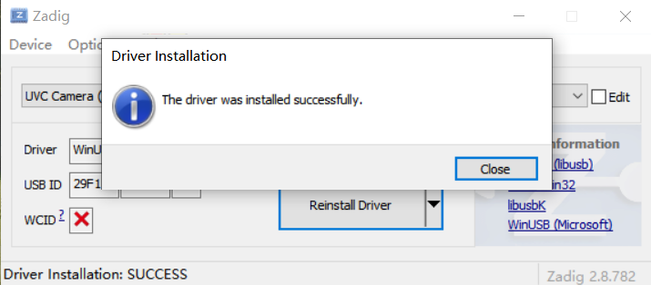
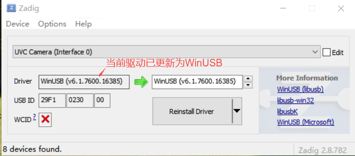

# K230 场景实战-dpu深度相机POC


版权所有©2023北京嘉楠捷思信息技术有限公司

<div style="page-break-after:always"></div>

## 免责声明

您购买的产品、服务或特性等应受北京嘉楠捷思信息技术有限公司（“本公司”，下同）及其关联公司的商业合同和条款的约束，本文档中描述的全部或部分产品、服务或特性可能不在您的购买或使用范围之内。除非合同另有约定，本公司不对本文档的任何陈述、信息、内容的正确性、可靠性、完整性、适销性、符合特定目的和不侵权提供任何明示或默示的声明或保证。除非另有约定，本文档仅作为使用指导参考。

由于产品版本升级或其他原因，本文档内容将可能在未经任何通知的情况下，不定期进行更新或修改。

## 商标声明

、“嘉楠”和其他嘉楠商标均为北京嘉楠捷思信息技术有限公司及其关联公司的商标。本文档可能提及的其他所有商标或注册商标，由各自的所有人拥有。

**版权所有 © 2023北京嘉楠捷思信息技术有限公司。保留一切权利。**
非经本公司书面许可，任何单位和个人不得擅自摘抄、复制本文档内容的部分或全部，并不得以任何形式传播。

<div style="page-break-after:always"></div>

## K230 dpu深度相机

将k230设备模拟成一台深度相机，将内部dpu模块处理的深度图实时传输到pc机电脑，支持多种数据传输格式，支持多K230设备，支持stream/snap功能，stream性能达720p@10fps。

### 硬件环境

- K230-USIP-LP3-EVB-V1.0/K230-USIP-LP3-EVB-V1.1 * 1个
- 指定的sensor模组一个
- 一台windows系统pc电脑
- typeC线两根

## 概述

dpu深度相机POC支持如下功能:

- PC端支持多种格式图像捕获：如彩色图，深度图,散斑图，红外图等。
- 支持stream/snap捕获方式：可捕获实时数据流或某一帧图像。
- PC端可连接多个k230设备，支持多k230设备图像同时捕获。
- 传输性能:stream模式每台k320设备性能达720p@10fps。
- 帧率控制:可设置每秒传输帧数。

## 使用说明

1. 编译烧录镜像：编译命令为`make CONF=k230_evb_dpu_depth_camera_defconfig`，生成的镜像在`output/k230_evb_dpu_depth_camera_defconfig/images/sysimage-sdcard.img`，烧录该镜像，启动后自动运行dpu深度相机程序。
1. 在PC电脑上更新k230设备uvc驱动为"WinUSB"驱动：参考后面章节介绍。
1. PC端执行：先将k230_sdk/src/common/cdk/user/thirdparty/windows_uvc/lib_uvc/bin/x64/release目录文件下载到pc电脑，后执行该文件夹下run.bat文件，可通过修改批处理文件内容，来执行不同功能。
   run.bat文件使用test_uvc.exe命令来执行不同功能，test_uvc.exe执行命令如下

```shell
Usage: grab stream frame Usage: %s -s 0 -m 0 -f ./bin/0702/H1280W720.bin -t 0.
       snap frame  Usage: %s -s 1 -m 1 -f ./bin/0702/H1280W720.bin -t 0.
       transfer file Usage: %s -m 2 -i ./bin/H1280W720_conf.bin -o /sharefs/H1280W720_conf.bin.
                    -s <local filepathname>: save frame data to local file
                    -m <work mode>: work mode. 0:grab data,  1:snap data, 2:tranfer file
                    -i <local filepathname>: transfer local filename.
                    -o <remote filepathname>: k230 receive filename.
                    -f <ref/cfg filepathname>: k230 update ref/cfg file.
                    -t <dpu image mode>: dpu image mode. 0:RGB_DEPTH, 1：RGB_IR, 2：IR_DEPTH, 3：SPECKLE, 4：IR, 5：DEPTH
                    -r <fps>: set fps.
```

## 更新驱动

将k230_sdk/src/common/cdk/user/thirdparty/windows_uvc/lib_uvc/bin/x64/release目录文件下载到pc电脑后，请先更新windows下的uvc驱动后再运行批处理脚本。

- 确保k230大小核正常启动，并将其模拟成usb device 设备。使用typeC线将k230 otg口与电脑usb口相连接。
- 双击release目录下的zadig-2.8.exe软件，打开后点击菜单栏：Options->List All Devices,选中该项。


- 从下拉列表中选择K230 uvc设备,名称为“UVC Camera（interface 0）”.

- 如果未更新该设备的windows驱动，windows会默认安装“usbvideo”驱动，此时需将其替换成“WinUSB”驱动。点击按钮"Replace Driver"替换驱动。



- 如上图所示，表示成功安装“WinUSB”驱动。此时再从下拉列表中选择K230 uvc设备,名称为“UVC Camera（interface 0）”，会显示出当前安装的驱动为“WinUSB”驱动。


## 功能演示

- 获取k230设备深度图和彩色图
  将run.bat修改成如下命令,请将H1280W720.bin替换成sensor模组相匹配的文件。会在./data文件夹下实时生成深度图和彩色图图片。

  ```shell
  test_uvc.exe -m 0 -s 1 -f "./bin/0702/H1280W720.bin" -t 0
  ```

- 每秒抓取一张k230设备深度图和彩色图，请将H1280W720.bin替换成sensor模组相匹配的文件。会在./data文件夹下每个一秒生成深度图和彩色图图片。

  ```shell
  test_uvc.exe -m 1 -s 1 -f "./bin/0702/H1280W720.bin" -t 0
  ```

- 帧率控制，设置每秒传输2帧。

  ```shell
  test_uvc.exe -m 1 -s 1 -f "./bin/0702/H1280W720.bin" -t 0 -r 2
  ```
